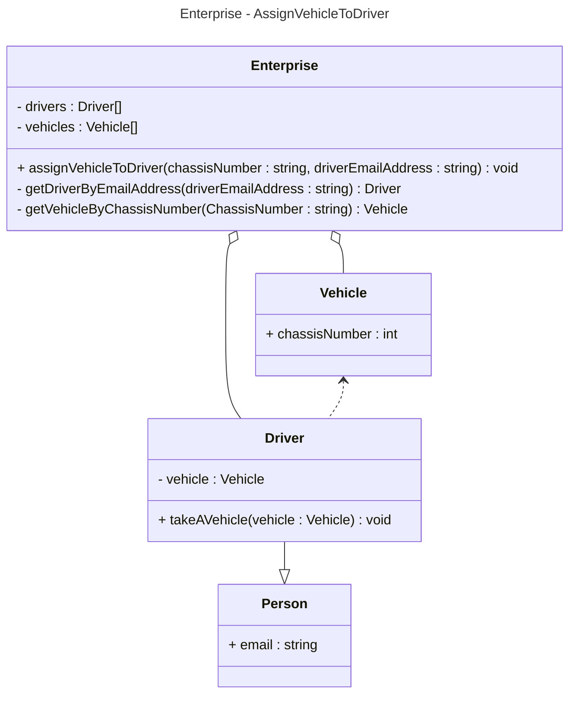

```mermaid
---
title: Enterprise - AssignVehicleToDriver
---
classDiagram
    class Person{
        + email : string
    }
    class Driver{
        - vehicle : Vehicle
        + takeAVehicle(vehicle : Vehicle) void
    }
    class Vehicle{
        + chassisNumber : int
    }
    class Enterprise {
        - drivers : Driver[]
        - vehicles : Vehicle[]
        + assignVehicleToDriver(chassisNumber : string, driverEmailAddress : string) void
        - getDriverByEmailAddress(driverEmailAddress : string) Driver
        - getVehicleByChassisNumber(ChassisNumber : string) Vehicle
    }

    Driver --|> Person
    Enterprise o-- Vehicle
    Enterprise o-- Driver
    Vehicle <.. Driver

```
